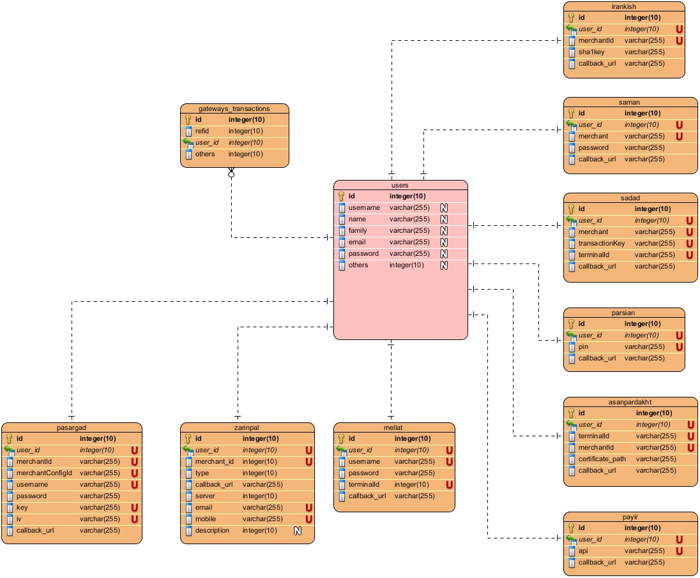

<div dir="rtl">


```
متاسفانه این پکیج دیگر پشتیبانی نمی شود
```

پکیج اتصال به تمامی IPG ها و  بانک های ایرانی.
 
  
این پکیج با ورژن های  
(  ۴ و ۵ و ۶ لاراول )  
 لاراول سازگار می باشد  
  
  
پشتیبانی تنها از درگاهای زیر می باشد:  
 1. MELLAT  
 2. SADAD (MELLI)  
 3. SAMAN  
 4. PARSIAN  
 5. PASARGAD  
 6. ZARINPAL  
 8. ASAN PARDAKHT   
 9. PAY.IR ( برای فراخوانی از 'payir' استفاده نمایید)  
 10. Irankish (**جدید** -  برای فراخوانی از 'irankish' استفاده نمایید)  
----------  
  
  
**نصب**:  
  
دستورات زیر را جهت نصب دنبال کنید :  
  
**مرحله ۱)**  
  
 composer require larabook/gateway    
**مرحله ۲)**  
  
  تغییرات زیر را در فایل config/app.php اعمال نمایید:  
  
**توجه برای نسخه های لاراول ۶ به بعد  این مرحله نیاز به انجام نمی باشد**   
</div>  
  
```php  
  
'providers' => [  
  ...  
  Larabookir\Gateway\GatewayServiceProvider::class, // <-- add this line at the end of provider array  
],  
  
  
'aliases' => [  
  ...  
  'Gateway' => Larabookir\Gateway\Gateway::class, // <-- add this line at the end of aliases array  
]  
  
```  
  
  
  
<div dir="rtl">  
  
**مرحله ۳) - انتقال فایل های مورد نیاز**  
  
برای لاراول ۵ :  
</div>  
  
 php artisan vendor:publish --provider=Larabookir\Gateway\GatewayServiceProviderLaravel5  
  
<div dir="rtl">  
برای لاراول ۶ به بعد :  
</div>  
  
 php artisan vendor:publish   
  
<div dir="rtl">  
سپس این گزینه را انتخاب کنید :  "Larabookir\Gateway\GatewayServiceProviderLaravel6"  
  
  
**مرحله ۴) - تنظیم نام جداول**  
  
حال فایل gateway.php  را در مسیر app/ را باز نموده و  در صورت تمایل نام جداول مربوط به درگاه های پرداخت و همچنین نام جدول تراکنش ها را ویرایش نمایید. توجه داشته باشید در بخش user_table باید نام جدول کاربران خود را وارد نمایید.  
  
  
  
**مرحله ۵) - ایجاد جداول**  
  
 php artisan migrate  
  
  
**مرحله ٦)**    سپس به مدل کاربر خود رفته و توابع زیر را برای دسترسی مدل کاربر به درگاه های پرداخت وارد نمایید.

```php  

public function zarinpalGateway()  
{  
  return $this->hasOne(\Larabookir\Gateway\Models\ZarinpalGateway::class);  
}  
  
public function mellatGateway()  
{  
  return $this->hasOne(\Larabookir\Gateway\Models\MellatGateway::class);  
}  
  
public function samanGateway()  
{  
  return $this->hasOne(\Larabookir\Gateway\Models\SamanGateway::class);  
}  
  
public function payirGateway()  
{  
  return $this->hasOne(\Larabookir\Gateway\Models\PayirGateway::class);  
}  
  
public function irankishGateway()  
{  
  return $this->hasOne(\Larabookir\Gateway\Models\ZarinpalGateway::class);  
}  
  
public function sadadGateway()  
{  
  return $this->hasOne(\Larabookir\Gateway\Models\SadadGateway::class);  
}  
  
public function parsianGateway()  
{  
  return $this->hasOne(\Larabookir\Gateway\Models\ParsianGateway::class);  
}  
  
public function pasargadGateway()  
{  
  return $this->hasOne(\Larabookir\Gateway\Models\PasargadGateway::class);  
}  
  
public function asanPardakhtGateway()  
{  
  return $this->hasOne(\Larabookir\Gateway\Models\AsanpardakhtGateway::class);  
}  
  
``` 

**مرحله ٧)**  
  
حال میتوایند برای اتصال به api  بانک  با ارسال شیء کاربر از جدول کاربران خود، از یکی از روش های زیر به انتخاب خودتان استفاده نمایید . (Facade , Service container):  
</div>  
   
 1. \$mellat = new Mellat($user);  
   
    Gateway::make($mellat, $user)  
      
 2. Gateway::make('mellat', $user)  
 3. Gateway::mellat($user)  
 4. \$mellat = new Mellat($user)  
   
    app('gateway')->make($mellat, $user);  
      
 5. app('gateway')->mellat($user)  
   
<div dir="rtl">  
  
 مثال :‌اتصال به بانک ملت (درخواست توکن و انتقال کاربر به درگاه بانک)  
توجه :‌ مقدار متد price   به ریال وارد شده است و معادل یکصد تومان می باشد  
  
یک روت از نوع GET با آدرس /bank/request ایجاد نمایید و کد های زیر را در آن قرار دهید .  
  
</div>  
  
  
```php  
  
try {  
  
   $gateway = \Gateway::make('mellat', $user);  
  
   $gateway->setCallback(url('/bank/response')); // optional - You can also change callback url and use new url instead of user's callback url 
   $gateway->price(1000)  
           // setShipmentPrice(10) // optional - just for paypal  
           // setProductName("My Product") // optional - just for paypal  
           ->ready();  
  
   $refId =  $gateway->refId(); // شماره ارجاع بانک  
   $transID = $gateway->transactionId(); // شماره تراکنش  
  
   // در اینجا  
   //  شماره تراکنش  بانک را با توجه به نوع ساختار دیتابیس تان   
   //  در جداول مورد نیاز و بسته به نیاز سیستم تان  
   // ذخیره کنید .  
  
   return $gateway->redirect();  
  
} catch (\Exception $e) {  
  
   echo $e->getMessage();  
}  
  
```  
  
<div dir="rtl">  
  
 و سپس روت با مسیر /bank/response  و از نوع  Get ایجاد نمایید و کد های زیر را در آن قرار دهید :  
  
</div>  
  
  
```php  
  
try {   
  
   $gateway = \Gateway::verify();  
   $trackingCode = $gateway->trackingCode();  
   $refId = $gateway->refId();  
   $cardNumber = $gateway->cardNumber();  
  
   // تراکنش با موفقیت سمت بانک تایید گردید  
   // در این مرحله عملیات خرید کاربر را تکمیل میکنیم  
  
} catch (\Larabookir\Gateway\Exceptions\RetryException $e) {  
  
    // تراکنش قبلا سمت بانک تاییده شده است و  
    // کاربر احتمالا صفحه را مجددا رفرش کرده است  
    // لذا تنها فاکتور خرید قبل را مجدد به کاربر نمایش میدهیم  
  
    echo $e->getMessage() . "<br>";  
  
} catch (\Exception $e) {  
  
    // نمایش خطای بانک  
    echo $e->getMessage();  
}  
  
```  

<hr>

<div dir="rtl">  

**دیاگرام ارتباطی جداول ایجاد شده با جدول کاربران**  

 </div>
  

  
  
<hr>

 <div dir="rtl">  

در صورت تمایل جهت همکاری در توسعه :  
  
 1. توسعه مستندات پکیج.  
 2. گزارش باگ و خطا.  
 3. همکاری در نوشتن ماژول دیگر بانک ها برای این پکیج .  
  
  
درصورت بروز هر گونه   
 [باگ](https://github.com/larabook/gateway/issues) یا [خطا](https://github.com/larabook/gateway/issues)  .  
  ما را آگاه سازید .  
    
این پکیج از پکیج دیگری بنام poolport  مشتق شده است اما برخی از عملیات آن متناسب با فریموورک لارول تغییر کرده است  
</div>
